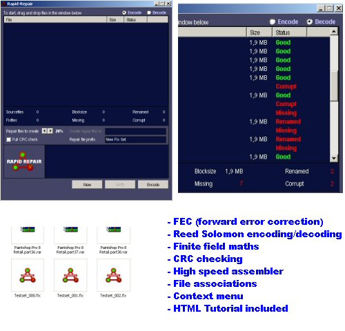



## Rapid Repair

### Description

Repair files by using redundant data generated by Reed Solomon encoding and finite field maths, just like PAR, which is widely used on Usenet.

The custom DLL needed for the program to work can be found at http://cp108629-b.landg1.lb.home.nl/ffixlib.dll
 
### More Info
 
I tested the code for a while, but it can always crash when something is not right. This because of the assembler code and memory techniques.

I'm not responsible for any damage to your system after using this code.

             |
---                |---
**Submitted On**   |2006-08-29 00:32:34
**By**             |[TPD Software](https://github.com/Planet-Source-Code/PSCIndex/blob/master/ByAuthor/tpd-software.md)
**Level**          |Advanced
**User Rating**    |5.0 (20 globes from 4 users)
**Compatibility**  |VB 6\.0
**Category**       |[Complete Applications](https://github.com/Planet-Source-Code/PSCIndex/blob/master/ByCategory/complete-applications__1-27.md)
**World**          |[Visual Basic](https://github.com/Planet-Source-Code/PSCIndex/blob/master/ByWorld/visual-basic.md)
**Archive File**   |[Rapid\_Repa2016408282006\.zip](https://github.com/Planet-Source-Code/tpd-software-rapid-repair__1-66402/archive/master.zip)

